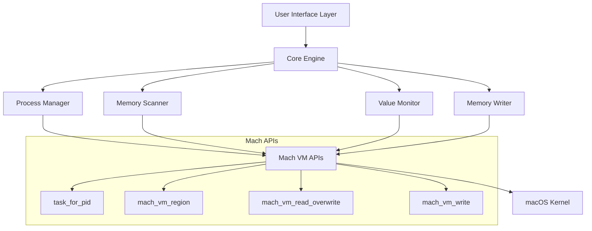

# CheatEngine Design Document

## Overview

CheatEngine is a C++17 educational tool for macOS that demonstrates operating system memory management through process introspection. The application uses Mach kernel APIs to attach to user-owned processes, enumerate memory regions, scan for values, and monitor memory changes in real time. The architecture emphasizes educational value while maintaining system security and performance.

## Architecture

### High-Level Architecture



### Component Responsibilities

- **User Interface Layer**: Command-line interface for user interactions and result display
- **Core Engine**: Central coordinator managing component interactions and application state
- **Process Manager**: Handles process attachment, validation, and task port management
- **Memory Scanner**: Implements memory region enumeration and value searching
- **Value Monitor**: Tracks memory locations for real-time change detection
- **Memory Writer**: Provides safe memory modification capabilities

## Components and Interfaces

### Process Manager

```cpp
class ProcessManager {
public:
    struct ProcessInfo {
        pid_t pid;
        std::string executable_path;
        task_t task_port;
        bool is_attached;
    };
    
    bool attachToProcess(pid_t pid);
    void detachFromProcess();
    ProcessInfo getCurrentProcess() const;
    bool validateProcessOwnership(pid_t pid) const;
    
private:
    ProcessInfo current_process_;
    bool acquireTaskPort(pid_t pid, task_t& task_port);
};
```

### Memory Scanner

```cpp
class MemoryScanner {
public:
    struct MemoryRegion {
        mach_vm_address_t start_address;
        mach_vm_size_t size;
        vm_prot_t protection;
        std::string region_type;
        bool is_readable;
        bool is_writable;
        bool is_executable;
    };
    
    struct SearchResult {
        mach_vm_address_t address;
        std::vector<uint8_t> context;
        size_t value_size;
    };
    
    std::vector<MemoryRegion> enumerateMemoryRegions(task_t task);
    std::vector<SearchResult> searchForValue(task_t task, const void* value, size_t size);
    bool readMemoryChunk(task_t task, mach_vm_address_t address, size_t size, std::vector<uint8_t>& buffer);
    
private:
    static constexpr size_t CHUNK_SIZE = 4096; // Page-aligned reading
    std::string getRegionTypeString(const MemoryRegion& region);
};
```

### Value Monitor

```cpp
class ValueMonitor {
public:
    struct MonitoredAddress {
        mach_vm_address_t address;
        size_t value_size;
        std::vector<uint8_t> last_value;
        std::chrono::steady_clock::time_point last_update;
    };
    
    struct ValueChange {
        mach_vm_address_t address;
        std::vector<uint8_t> old_value;
        std::vector<uint8_t> new_value;
        std::chrono::steady_clock::time_point timestamp;
    };
    
    void addMonitoredAddress(mach_vm_address_t address, size_t size);
    void removeMonitoredAddress(mach_vm_address_t address);
    std::vector<ValueChange> checkForChanges(task_t task);
    std::vector<MonitoredAddress> getMonitoredAddresses() const;
    
private:
    std::vector<MonitoredAddress> monitored_addresses_;
    std::mutex monitor_mutex_;
};
```

### Memory Writer

```cpp
class MemoryWriter {
public:
    struct WriteOperation {
        mach_vm_address_t address;
        std::vector<uint8_t> old_value;
        std::vector<uint8_t> new_value;
        std::chrono::steady_clock::time_point timestamp;
        bool success;
    };
    
    bool writeMemory(task_t task, mach_vm_address_t address, const void* data, size_t size);
    bool verifyWritePermissions(task_t task, mach_vm_address_t address, size_t size);
    std::vector<WriteOperation> getWriteHistory() const;
    
private:
    std::vector<WriteOperation> write_history_;
    std::mutex write_mutex_;
};
```

## Data Models

### Core Data Structures

```cpp
// Value types for searching and monitoring
enum class ValueType {
    INT32,
    INT64,
    FLOAT32,
    FLOAT64,
    BYTES
};

struct SearchValue {
    ValueType type;
    std::vector<uint8_t> data;
    
    template<typename T>
    static SearchValue create(T value);
};

// Memory protection flags wrapper
struct ProtectionFlags {
    bool readable;
    bool writable;
    bool executable;
    
    static ProtectionFlags fromVMProt(vm_prot_t prot);
    std::string toString() const;
};

// Application configuration
struct CheatEngineConfig {
    size_t max_search_results = 1000;
    std::chrono::milliseconds monitor_interval{100};
    size_t read_chunk_size = 4096;
    bool enable_memory_writing = false;
    bool show_educational_info = true;
};
```

## Error Handling

### Error Categories

1. **Process Access Errors**
   - Invalid PID
   - Process not owned by user
   - Process terminated during operation
   - Task port acquisition failure

2. **Memory Operation Errors**
   - Invalid memory address
   - Protection violation
   - Memory region unmapped
   - Insufficient permissions

3. **System Resource Errors**
   - Memory allocation failure
   - System call interruption
   - Resource limits exceeded

### Error Handling Strategy

```cpp
class CheatEngineException : public std::exception {
public:
    enum class ErrorType {
        PROCESS_ACCESS,
        MEMORY_OPERATION,
        SYSTEM_RESOURCE,
        INVALID_PARAMETER
    };
    
    CheatEngineException(ErrorType type, const std::string& message, int system_error = 0);
    
    ErrorType getType() const { return type_; }
    int getSystemError() const { return system_error_; }
    const char* what() const noexcept override { return message_.c_str(); }
    
private:
    ErrorType type_;
    std::string message_;
    int system_error_;
};

// Error handling macros for Mach API calls
#define MACH_CHECK(call) \
    do { \
        kern_return_t kr = (call); \
        if (kr != KERN_SUCCESS) { \
            throw CheatEngineException(CheatEngineException::ErrorType::MEMORY_OPERATION, \
                                     "Mach API call failed: " #call, kr); \
        } \
    } while(0)
```

## Testing Strategy

### Unit Testing Approach

1. **Mock Mach APIs**: Create test doubles for system calls to enable isolated testing
2. **Memory Region Testing**: Validate memory region parsing and categorization logic
3. **Value Search Testing**: Test search algorithms with known memory patterns
4. **Error Condition Testing**: Verify proper error handling for various failure scenarios

### Integration Testing

1. **Self-Process Testing**: Test against the CheatEngine process itself for safe validation
2. **Permission Validation**: Verify security checks prevent unauthorized access
3. **Memory Safety**: Ensure no buffer overflows or invalid memory access
4. **Performance Testing**: Validate efficient memory scanning with large address spaces

### Educational Validation

1. **Concept Demonstration**: Verify that memory management concepts are clearly illustrated
2. **API Usage Examples**: Ensure proper demonstration of Mach VM API usage patterns
3. **Security Awareness**: Validate that security implications are properly explained

## Implementation Notes

### Performance Considerations

- Use page-aligned memory reads (4KB chunks) for optimal performance
- Implement lazy loading for memory region enumeration
- Cache memory region information to avoid repeated system calls
- Use memory-mapped I/O where appropriate for large memory scans

### Security Considerations

- Validate process ownership before any memory operations
- Implement read-only mode by default with explicit opt-in for memory writing
- Log all memory modification operations for audit purposes
- Provide clear warnings about the educational nature of the tool

### Educational Features

- Include inline documentation explaining Mach VM concepts
- Provide visual representation of memory layout and protection flags
- Show the relationship between virtual and physical memory concepts
- Demonstrate CPU cache locality through memory access patterns

### Build System

- Use CMake for cross-platform build configuration
- Support both Debug and Release configurations
- Include compiler flags for C++17 standard compliance
- Integrate with macOS code signing for distribution